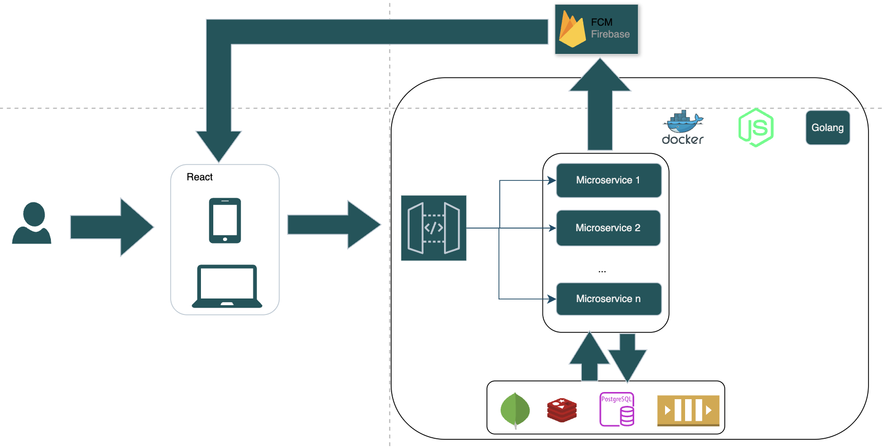

<div align="center">
<h1>MINI CRM</h1>
</div>

# Introduction
This is mini CRM with basic features.

## 🚀 Mini CRM Feature Breakdown
| Feature                        |
|--------------------------------|
| **Leads & Contact Management** |
| **Sales Pipeline (Kanban)**    |
| **Task & Follow-Up Reminders** |
| **Notes & Activity Logging**   |
| **Email & WhatsApp Integration** |
| **AI Lead Scoring**            |
| **Role-Based Access**          |
| **Reports & Dashboards**       |


# Architecture
- Programing Language: 
    + Backend: Golang(version 1.22 or above), NodeJS(v20 or above)
    + Frontend: ReactJS(Frontend)
- Protocol: HTTP(REST API)
- SQL: PostgreSQL
- NoSQL: MongoDB
- Caching: Redis, Memcached
- Message Queue: Redis pub/sub or NATS Jetstream
- Design pattern: Repository pattern, Circuit breaker pattern
- Monitor api: Sentry, Jaeger, Opentelemetry
- Document: Swagger

The architecture mechanism




# Commit guidelines
- `{action}-{write briefly content (max 50 characters)}`

# Monitor
You must install **Jaeger** and **Opentelemetry** on the server and access below address to monitor
```
{{your IP or domain}}:16686
```


<div align="center">
Copyright © 2025 AnhLe. All rights reserved.
</div>